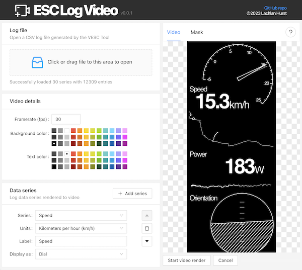
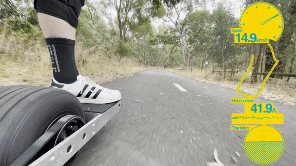

# ESC Log Video
Tool for generating data overlay videos from VESC log files.

To use the tool visit the following link. It's a pure web application with no installation required.

[https://lachlanhurst.github.io/esc-log-video/](https://lachlanhurst.github.io/esc-log-video/)

After generating a video an editing tool can be used to overlay your data on top of ride footage.

> **Note**
> The application is 100% web-based in the browser, your data is not uploaded to a server for processing. Unfortunately the libraries used to generate the video in the browser impose some limitations; namely which browsers are supported. ESC Log Video is best used in Chrome, but Edge and Firefox should work. Safari is not supported at all.

## Supported File Formats
The following file formats are supported, these **must be provided as CSV files**.
- [VESC Tool](https://vesc-project.com/vesc_tool) log files as generated by the mobile app (Android and iOS)
- [Float Control](https://apps.apple.com/al/app/float-control-vesc-companion/id1590924299?platform=iphone) log files (iOS)
- [Metr App](https://metr.at/) (Android and iOS)
- Format not listed? Then drop a sample file in a GitHub issue and I'll take a look at it, most CSV based formats are easy to support. Or better yet, create a pull request!

# Development
Following section should help get you started if you would like to contribute to development. If you just want to use the app, then just use the [already deployed version](https://lachlanhurst.github.io/esc-log-video/).

## Dependencies
You'll to ensure node and npm are installed.

## Getting started
Clone the repo

    git clone https://github.com/lachlanhurst/esc-log-video.git
    cd esc-log-video

Install dependencies

    npm install

Run local dev server

    npm run dev

The URL to access the local dev server should then be printed to stdout, you can open this in your browser.

## Unit Tests
ESC Log Video uses the vitest unit test framework. The following command runs all unit tests.

    npm test

## Deployment

Deploy to GitHub pages

    npm run deploy

## Recommended IDE Setup

- [VS Code](https://code.visualstudio.com/) + [Volar](https://marketplace.visualstudio.com/items?itemName=Vue.volar) (and disable Vetur) + [TypeScript Vue Plugin (Volar)](https://marketplace.visualstudio.com/items?itemName=Vue.vscode-typescript-vue-plugin).
